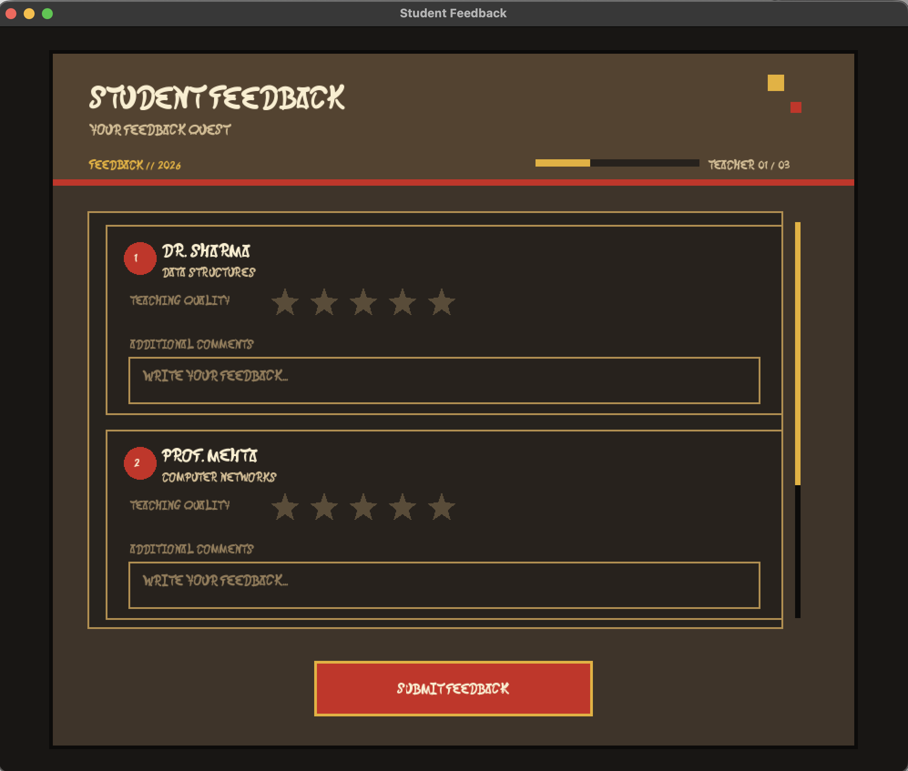
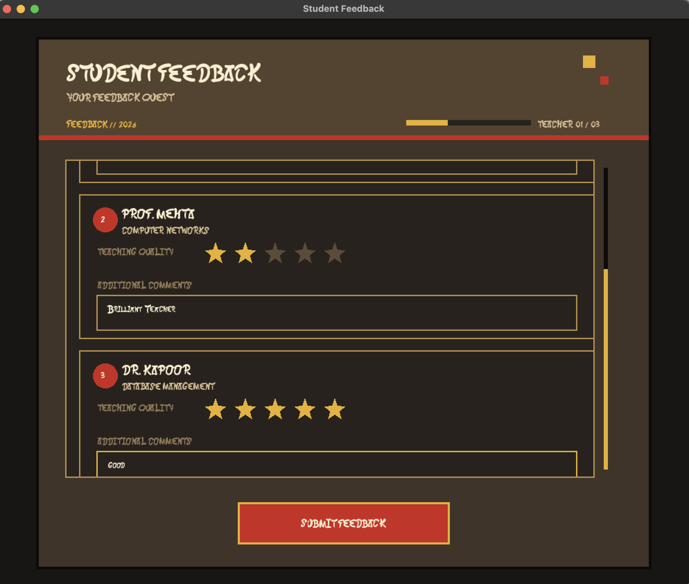
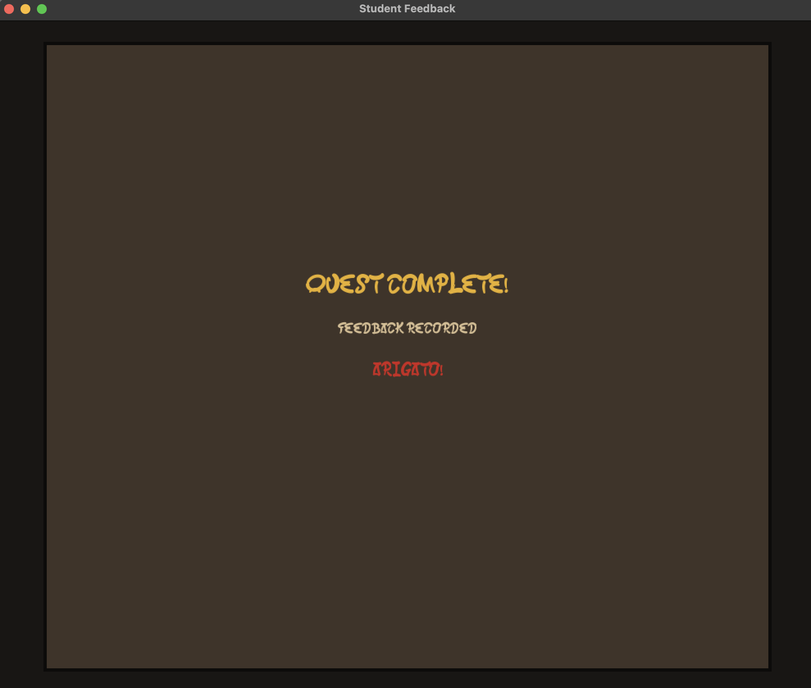

# Student Feedback System

A desktop graphical user interface prototype for collecting structured student feedback about multiple faculty members.

The project is built from scratch in C++ using SFML and CMake rather than a conventional web stack. The interface follows a vintage Japanese 2D game aesthetic, combining pixel typography, warm retro colors, game-inspired progress indicators, rating stars, scrollable teacher cards, and a dedicated completion state.

## Project Overview

The goal of the project is to demonstrate practical user-interface design and usability principles through an interactive Student Feedback System.

Instead of implementing a conventional browser-based form, the application uses SFML to render the complete interface as a native desktop GUI. The code is organized into separate UI components so that visual styling, interaction logic, and application flow remain maintainable.

### Core Workflow

1. Review the feedback form.
2. Navigate through the feedback cards for three teachers.
3. Rate each teacher using a five-star rating system.
4. Enter additional comments.
5. Scroll through the feedback area when required.
6. Submit the completed feedback.
7. View the completion screen.

## Design Direction

The interface intentionally avoids the appearance of a conventional academic form.

The visual language is inspired by vintage Japanese games and retro 2D interfaces:

- Pixel-oriented typography
- Warm parchment and brown tones
- Vermilion red accents
- Muted gold highlights
- Matcha green accents
- Chunky borders and framed panels
- Game-style progress information
- Teacher number badges
- Star-based ratings
- Dedicated completion state

The visual theme is centralized through the `Theme` class so that the color palette, typography, and font configuration can be changed without rewriting individual UI components.

## Features

### Multi-Teacher Feedback

The form supports feedback for three teachers:

- Dr. Sharma — Data Structures
- Prof. Mehta — Computer Networks
- Dr. Kapoor — Database Management

Each teacher has an independent feedback card containing:

- Teacher information
- Course information
- Five-star rating
- Additional comments field

### Interactive Rating System

The rating component provides five selectable stars with separate visual states for:

- Empty
- Hovered
- Selected

### Text Input

Each teacher has an independent feedback input field supporting:

- Focus detection
- Text entry
- Backspace
- Multi-line input
- Hover and focus visual states

### Scrollable Feedback Area

The teacher cards are contained inside a scrollable region, allowing multiple feedback sections to remain inside a single application window.

### Progress Interface

The header includes a game-inspired progress display showing the current feedback context.

### Completion Screen

After submission, the application switches to a dedicated completion state rather than simply closing the form.

## Screenshots

### Main Feedback Form

The initial state presents the application header, progress indicator, first teacher card, rating system, and feedback input.



### Scrollable Feedback Form

The feedback area can be scrolled to access the remaining teacher cards.



### Completion Screen

After submission, the application transitions to a dedicated completion screen.



## Architecture

The project follows a component-based C++ structure.

```text
StudentFeedback/
├── assets/
│   └── fonts/
│       └── pixel.ttf
│
├── include/
│   ├── App.h
│   ├── Button.h
│   ├── Rating.h
│   ├── TextInput.h
│   ├── Theme.h
│   └── UI.h
│
├── src/
│   ├── main.cc
│   ├── App.cc
│   ├── Button.cc
│   ├── Rating.cc
│   ├── TextInput.cc
│   ├── Theme.cc
│   └── UI.cc
│
├── CMakeLists.txt
├── README.md
└── .gitignore
```

### Component Responsibilities

| Component | Responsibility |
|---|---|
| `App` | Application lifecycle, event loop, screen state, rendering |
| `UI` | Main feedback screen, layout, scrolling, teacher cards |
| `Button` | Reusable interactive button |
| `Rating` | Five-star rating interaction and rendering |
| `TextInput` | Feedback text entry and focus handling |
| `Theme` | Centralized visual styling and typography |
| `main` | Application entry point |

## Theme System

A major architectural decision is separating visual styling from component logic.

Instead of scattering colors throughout the application, components use the `Theme` class:

```cpp
shape.setFillColor(Theme::panel());
shape.setOutlineColor(Theme::border());
text.setFillColor(Theme::textPrimary());
```

The actual palette is defined in:

```text
src/Theme.cc
```

This makes it possible to redesign the entire visual identity without modifying the core UI components.

## Technology Stack

- C++
- SFML 3.0.2
- CMake
- SFML Graphics
- SFML Window
- SFML System
- Custom pixel font
- Object-oriented component architecture

## Building the Project

### Requirements

- C++17-compatible compiler
- CMake 3.20 or newer
- SFML 3.x
- Pixel font located at `assets/fonts/pixel.ttf`

### Configure

From the project root:

```bash
cmake -S . -B build
```

### Build

```bash
cmake --build build
```

### Run

```bash
./build/student_feedback
```

## Interaction Model

The application uses SFML's event system rather than browser events.

The main application loop follows the standard desktop GUI pattern:

```text
Poll Events
     |
     v
Handle Input
     |
     v
Update UI State
     |
     v
Render
     |
     v
Display Frame
```

This keeps user input, application state, and rendering responsibilities distinct.

## UI Design Principles

### Clear Hierarchy

The application separates:

- Application title
- Feedback context
- Teacher information
- Rating controls
- Comment fields
- Submission action

### Immediate Feedback

Interactive elements change their visual state when the user hovers over or focuses them.

### Consistent Visual Language

The same palette, border treatment, typography, and spacing are reused throughout the application.

### Progressive Disclosure

Only the feedback cards currently visible in the scroll region occupy the main visual focus, while the remaining content can be accessed through scrolling.

### Clear Completion State

Submission results in an explicit completion screen so the user receives a clear indication that the workflow has ended.

## Why SFML?

A student feedback form is commonly implemented as a web page using HTML, CSS, and JavaScript.

This project intentionally takes a different approach.

SFML provides direct control over:

- Window rendering
- Shapes
- Text
- Input events
- Mouse interaction
- Custom UI components
- Animation-ready rendering

This makes the project useful for understanding graphical user-interface construction at a lower level rather than only composing prebuilt web controls.

## Development Goals

The project was designed to demonstrate more than a static form.

The main goals were:

- Learn desktop GUI rendering with C++
- Understand event-driven interaction
- Practice object-oriented UI architecture
- Build reusable interface components
- Separate presentation from component logic
- Implement interactive controls from scratch
- Explore pixel-art-oriented visual design
- Use CMake for a structured C++ project

## Possible Future Improvements

- Persistent feedback storage
- JSON or SQLite-based data storage
- Input validation
- Keyboard navigation
- Animated transitions
- Sound effects
- More detailed pixel-art decorations
- Theme switching
- Feedback summary and analytics
- Admin dashboard
- CSV export
- Network-based submission
- Responsive window scaling

## Project Status

The current version is an interactive desktop GUI prototype.

It focuses primarily on interface design, interaction, component architecture, and usability rather than backend persistence or deployment.

## Author

Built as a C++ graphical user-interface project using SFML and CMake.
